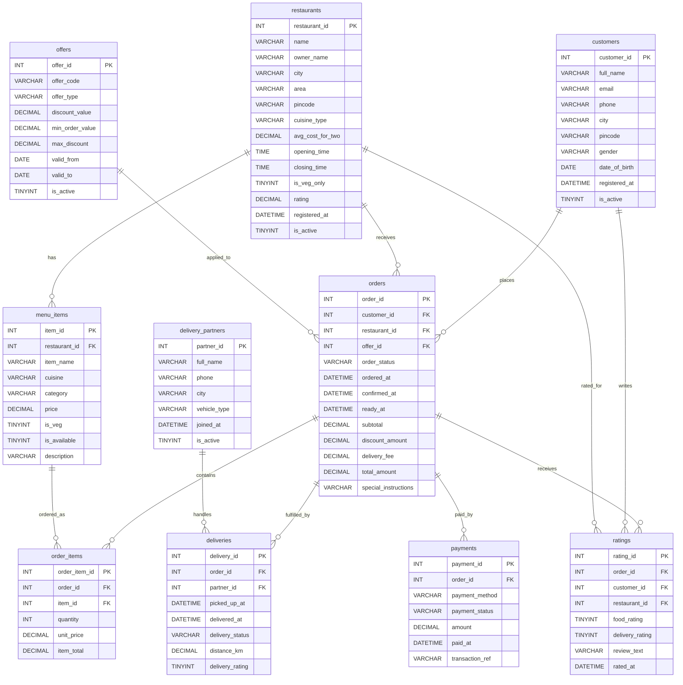

# QuickBite Hackathon Addendum: ER Diagrams and CSV Generator

This addendum provides three additions to the MySQL food delivery hackathon package:

- OLTP ER diagram
- OLAP galaxy schema ER diagram
- Instructor-only Python data generation script that writes final output as CSV files

## OLTP ER Diagram



## OLAP Galaxy Schema ER Diagram

```mermaid
erDiagram
    dim_cuisine ||--o{ dim_menu_item : classifies

    dim_date ||--o{ fact_orders : order_date
    dim_time ||--o{ fact_orders : order_time
    dim_customer ||--o{ fact_orders : customer
    dim_restaurant ||--o{ fact_orders : restaurant
    dim_city ||--o{ fact_orders : city
    dim_offer ||--o{ fact_orders : offer

    dim_date ||--o{ fact_order_items : order_date
    dim_restaurant ||--o{ fact_order_items : restaurant
    dim_menu_item ||--o{ fact_order_items : menu_item
    dim_cuisine ||--o{ fact_order_items : cuisine
    dim_customer ||--o{ fact_order_items : customer
    dim_city ||--o{ fact_order_items : city

    dim_date ||--o{ fact_payments : payment_date
    dim_time ||--o{ fact_payments : payment_time
    dim_customer ||--o{ fact_payments : customer
    dim_restaurant ||--o{ fact_payments : restaurant
    dim_payment_method ||--o{ fact_payments : method

    dim_date ||--o{ fact_deliveries : delivery_date
    dim_delivery_partner ||--o{ fact_deliveries : partner
    dim_restaurant ||--o{ fact_deliveries : restaurant
    dim_city ||--o{ fact_deliveries : city

    dim_date ||--o{ fact_ratings : rating_date
    dim_customer ||--o{ fact_ratings : customer
    dim_restaurant ||--o{ fact_ratings : restaurant
    dim_city ||--o{ fact_ratings : city

    dim_date {
        INT date_key PK
        DATE full_date
        SMALLINT year
        TINYINT quarter
        TINYINT month_num
        VARCHAR month_name
    }

    dim_time {
        INT time_key PK
        TINYINT hour_24
        TINYINT minute_of_hour
        VARCHAR time_of_day
        TINYINT is_peak_hour
    }

    dim_customer {
        INT customer_key PK
        INT customer_id
        VARCHAR full_name
        VARCHAR city
        VARCHAR gender
        VARCHAR age_band
    }

    dim_restaurant {
        INT restaurant_key PK
        INT restaurant_id
        VARCHAR name
        VARCHAR city
        VARCHAR area
        VARCHAR price_segment
    }

    dim_city {
        INT city_key PK
        VARCHAR city_name
        VARCHAR state
        VARCHAR region
        VARCHAR tier
    }

    dim_cuisine {
        INT cuisine_key PK
        VARCHAR cuisine_name
        VARCHAR cuisine_group
    }

    dim_menu_item {
        INT menu_item_key PK
        INT item_id
        VARCHAR item_name
        INT cuisine_key FK
        VARCHAR category
        VARCHAR price_band
    }

    dim_delivery_partner {
        INT partner_key PK
        INT partner_id
        VARCHAR full_name
        VARCHAR city
        VARCHAR vehicle_type
    }

    dim_payment_method {
        INT payment_method_key PK
        VARCHAR method_name
        VARCHAR method_group
    }

    dim_offer {
        INT offer_key PK
        INT offer_id
        VARCHAR offer_code
        VARCHAR offer_type
    }

    fact_orders {
        BIGINT order_surrogate_key PK
        INT order_id
        INT date_key FK
        INT time_key FK
        INT customer_key FK
        INT restaurant_key FK
        INT city_key FK
        INT offer_key FK
        DECIMAL total_amount
        INT num_items
    }

    fact_order_items {
        BIGINT order_item_surrogate_key PK
        INT order_item_id
        INT order_id
        INT date_key FK
        INT restaurant_key FK
        INT menu_item_key FK
        INT cuisine_key FK
        INT customer_key FK
        INT city_key FK
        INT quantity
        DECIMAL item_total
    }

    fact_payments {
        BIGINT payment_surrogate_key PK
        INT payment_id
        INT order_id
        INT date_key FK
        INT time_key FK
        INT customer_key FK
        INT restaurant_key FK
        INT payment_method_key FK
        DECIMAL amount
    }

    fact_deliveries {
        BIGINT delivery_surrogate_key PK
        INT delivery_id
        INT order_id
        INT date_key FK
        INT partner_key FK
        INT restaurant_key FK
        INT city_key FK
        INT delivery_time_mins
    }

    fact_ratings {
        BIGINT rating_surrogate_key PK
        INT rating_id
        INT order_id
        INT date_key FK
        INT customer_key FK
        INT restaurant_key FK
        INT city_key FK
        TINYINT food_rating
    }
```



## Instructor CSV Generator

Use `generate_quickbite_oltp_csv.py` to generate the final OLTP source files as CSVs. The script does not connect to MySQL and does not load data into a database.

### Run command

```bash
pip install faker
python generate_quickbite_oltp_csv.py
```

### Output folder

The script writes the following files to `quickbite_oltp_csv/`:

- `customers.csv`
- `restaurants.csv`
- `menu_items.csv`
- `offers.csv`
- `delivery_partners.csv`
- `orders.csv`
- `order_items.csv`
- `payments.csv`
- `deliveries.csv`
- `ratings.csv`
- `row_counts.csv`

### Suggested MySQL load order

Load the files in this order to preserve foreign key relationships:

1. `customers.csv`
2. `restaurants.csv`
3. `menu_items.csv`
4. `offers.csv`
5. `delivery_partners.csv`
6. `orders.csv`
7. `order_items.csv`
8. `payments.csv`
9. `deliveries.csv`
10. `ratings.csv`

